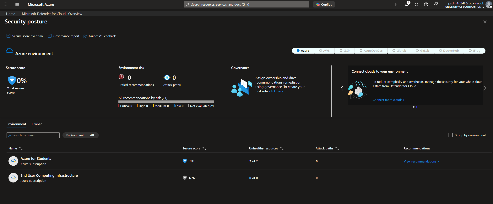
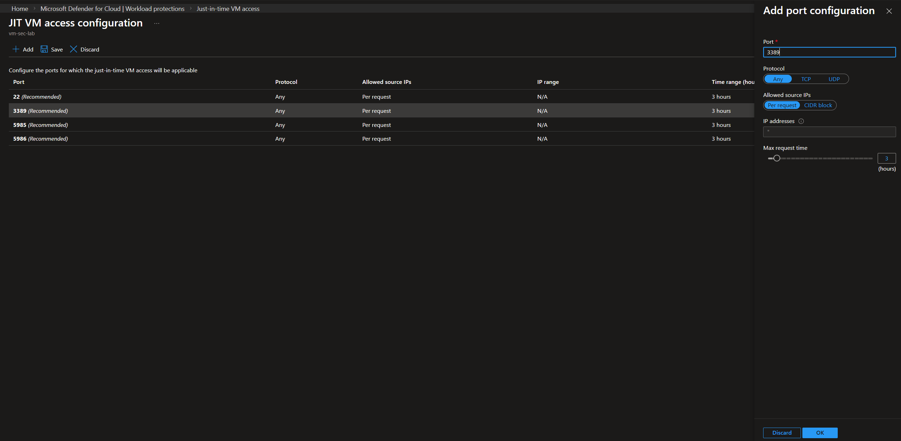
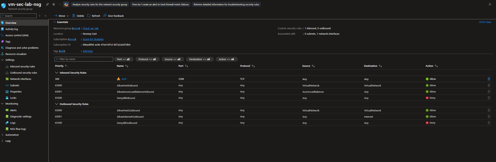
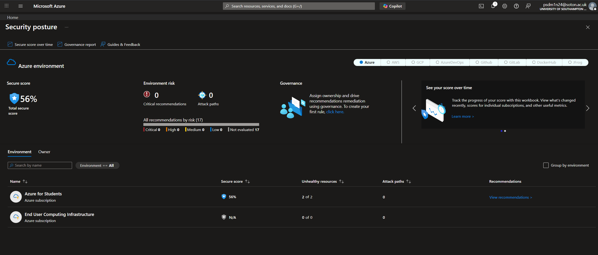

# 🛡️ Azure Security Posture Improvement using Microsoft Defender for Cloud

## 🚀 Key Achievement
- Improved Azure Secure Score from **0% → 56%**
- Reduced attack surface by securing exposed RDP access
- Implemented Just-In-Time (JIT) VM access and NSG hardening

---

## 📌 Overview
This project focuses on improving the Azure Secure Score by implementing security recommendations provided by Microsoft Defender for Cloud.

The goal was to simulate a real-world cloud hardening scenario by identifying misconfigurations, prioritizing risks, and applying security controls to improve the overall security posture of Azure resources.

---

## 🎯 Objective
Improve Azure Secure Score from ~0% to a significantly higher value by remediating critical security recommendations and reducing potential attack vectors.

---

## 🏗️ Architecture
Azure Resources → Defender for Cloud → Recommendations → Secure Score Improvement

---

## ⚙️ Steps Implemented

### 1. Accessed Microsoft Defender for Cloud
- Navigated to Secure Score dashboard  
- Identified current security posture  

**Purpose:** Understand baseline risk and available recommendations

---

### 2. Analyzed Security Recommendations
- Reviewed high-impact recommendations  
- Focused on exposed services (e.g., RDP access)

**Purpose:** Prioritize actions that reduce the highest security risks

---

### 3. Remediated Recommendations
- Used **“Fix”** option for automated remediation  
- Applied recommended security configurations  

**Purpose:** Quickly enforce best practices and improve security posture

---

### 4. Enabled Just-In-Time (JIT) VM Access
- Restricted RDP (port 3389) access  
- Allowed access only when requested and for limited time  

**Purpose:** Minimize exposure to brute-force and unauthorized access attacks

---

### 5. Configured Network Security Group (NSG)
- Reviewed inbound security rules  
- Controlled traffic to reduce attack surface  

**Purpose:** Enforce network-level security controls

---

### 6. Installed Guest Configuration Extension
- Enabled in-guest policy enforcement  
- Monitored VM compliance  

**Purpose:** Ensure security policies are enforced inside the VM

---

## ⚠️ Challenges Faced
- Azure UI complexity and navigation challenges  
- Understanding which recommendations provide maximum impact  
- Delays in Secure Score updates after remediation  
- Azure Monitor Agent (AMA) setup issues  

---

## 🧠 Key Learnings
- Cloud security posture management using Defender for Cloud  
- Risk-based prioritization of security recommendations  
- Importance of minimizing exposed ports (especially RDP)  
- Difference between reactive vs proactive security controls  
- Practical implementation of cloud hardening techniques  

---

## 🎯 Outcome
- Improved Azure Secure Score from **0% to 56%**  
- Reduced exposure of critical services (RDP)  
- Strengthened overall VM security posture  
- Gained hands-on experience with real-world cloud security controls  

---

## 📚 Skills Demonstrated
- Azure Security  
- Microsoft Defender for Cloud  
- Secure Score Optimization  
- Network Security (NSG)  
- Just-In-Time VM Access  
- Risk Mitigation & Cloud Hardening  

---

## 📸 Screenshots

### 🔴 Secure Score Before Remediation

---

### 🛠️ Just-In-Time (JIT) VM Access Configuration

---

### 🔐 Network Security Group (NSG) Rules

---

### 🟢 Secure Score After Remediation

